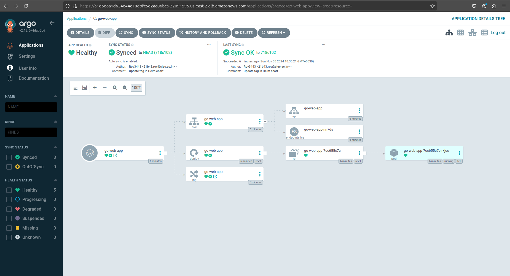
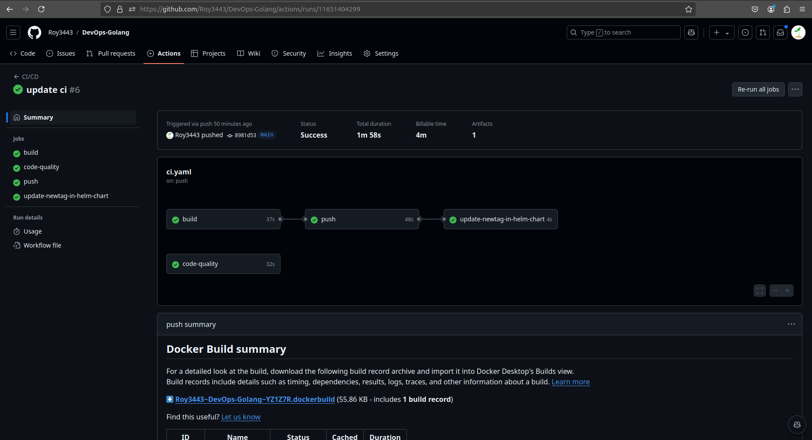

<h1>Complete DevOpsified Golang app</h1>
Devopsified a golang app(CI/CD)
 

Implemented DevOps practices for a Go web application, including containerization with a multi-stage Docker build and deployment to Kubernetes. Set up CI/CD pipelines using GitHub Actions for automated testing and Argo CD for GitOps-based deployment. Ensured efficient, secure, and scalable application delivery across environments.

